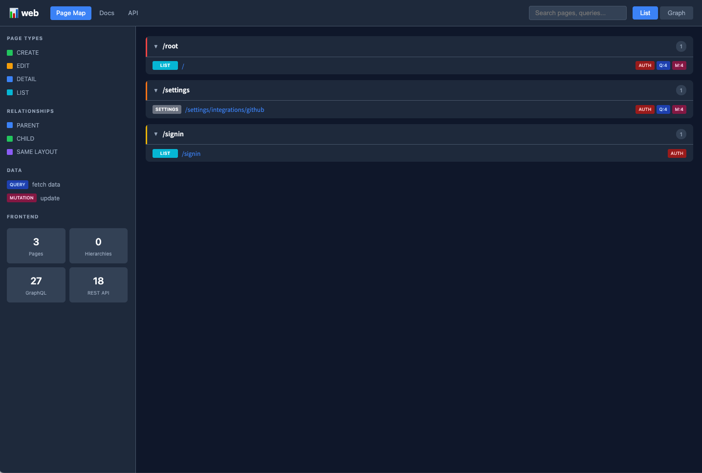
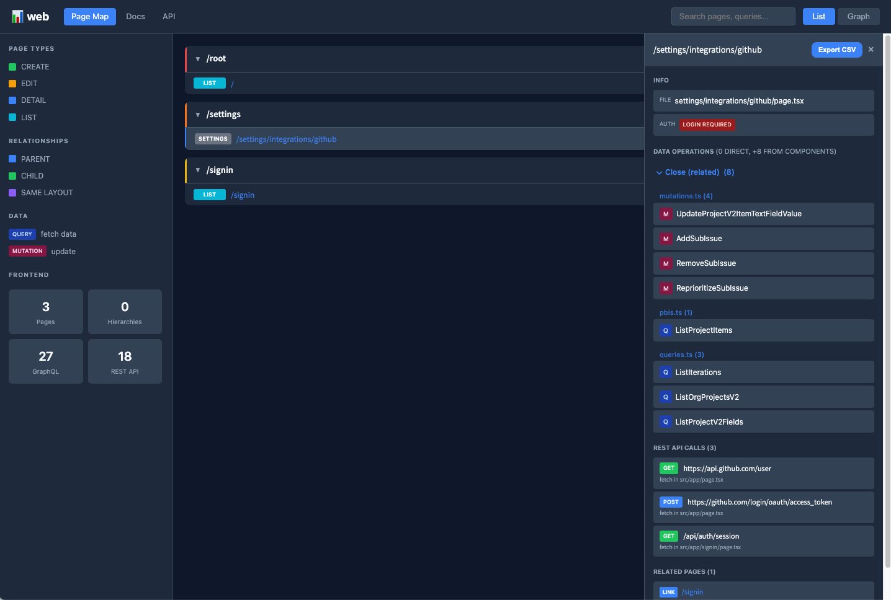
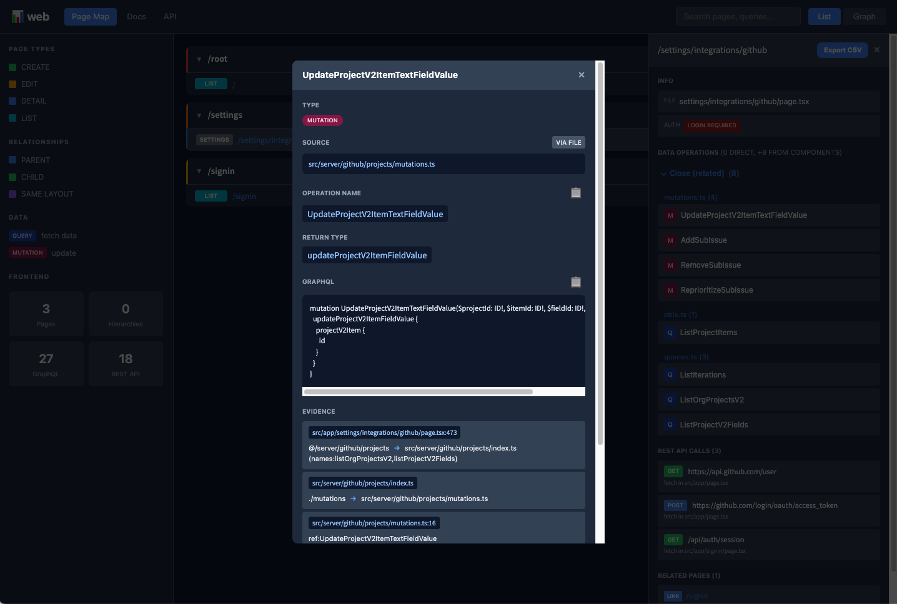
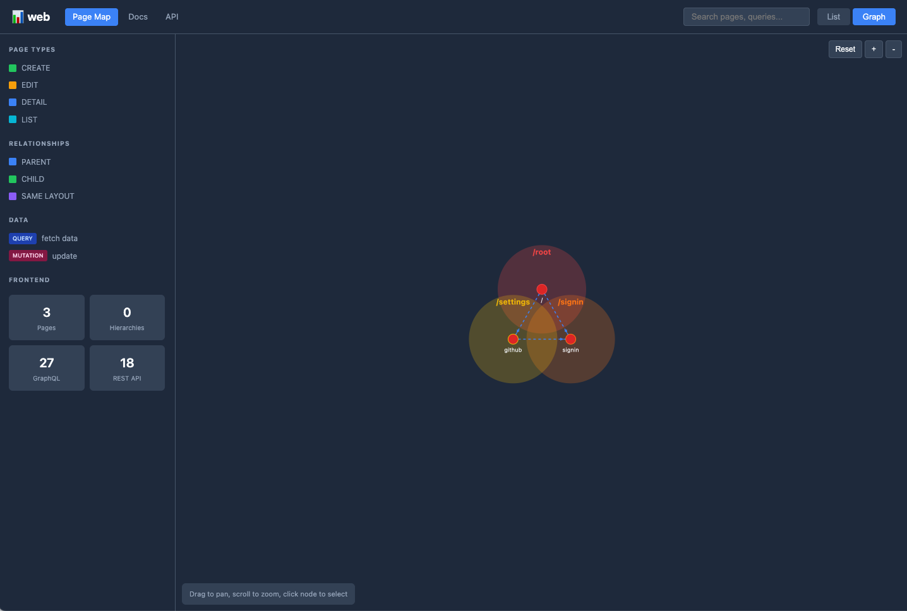

<p align="center">
  
</p>

<h1 align="center">@wtdlee/repomap</h1>

<p align="center">
  <a href="https://www.npmjs.com/package/@wtdlee/repomap"></a>
  <a href="https://opensource.org/licenses/MIT"></a>
</p>

<p align="center">
  Interactive documentation generator for code repositories.<br>
  Visualize pages, components, routes, and data flows with an intuitive web interface.
</p>

## ⚡ Performance

Powered by [SWC](https://swc.rs/) for blazing-fast AST parsing. Analyze large-scale codebases in seconds.

| Codebase | Scale | Analysis Time |
|----------|-------|---------------|
| Next.js Frontend | 30 pages, 970+ components, 640+ GraphQL ops | **~3.2s** |
| Rails + React Monolith | 5,700+ routes, 490 controllers, 820 models, 80+ gRPC | **~3.5s** |

> 🚀 **10x faster** than ts-morph based solutions. No caching needed!

## Screenshots

### Page Map - List View
Browse all pages with filtering by page type, relationships, and data operations.

<p align="center">
  
</p>

### Page Map - Detail Panel
View page details including file path, authentication status, data operations (queries/mutations), REST API calls, and related pages.

<p align="center">
  
</p>

### Page Map - Operation Detail Modal
Drill down into specific GraphQL operations with full query definition and evidence chain showing how the operation connects to the page.

<p align="center">
  
</p>

### Page Map - Graph View
Interactive force-directed graph visualization of page relationships and hierarchies.

<p align="center">
  
</p>

## Features

### 🗺️ Page Map
- **Multi-framework support** - Next.js (Pages/App Router), React SPA, Rails
- **SPA support** - Automatic detection of react-router-dom routes from App.tsx/jsx/js
- **Zero config for JS projects** - Works without tsconfig.json using smart defaults
- **Interactive graph view** - Visual representation of page relationships
- **Route analysis** - Automatic detection of routes, authentication, and data dependencies
- **React component tracking** - Detect React components used in Rails views

### 🛤️ Rails Map
- **Routes explorer** - Browse all routes with method, path, controller info
- **Controllers view** - List controllers with actions, filters, and inheritance
- **Models view** - View models with associations, validations, and scopes
- **gRPC services** - Browse gRPC services with RPC methods
- **Model Relationships diagram** - Auto-generated ER diagram using Mermaid
- **Advanced filtering** - Filter by namespace, HTTP methods (multi-select with Ctrl/Cmd)
- **Search** - Full-text search across routes, controllers, models

### 🔗 GraphQL Analysis
- **Operations mapping** - Extract queries, mutations, and fragments
- **Code Generator support** - Parse `__generated__/graphql.ts` (client preset)
- **Field details** - View all fields with types and arguments
- **Usage tracking** - See where operations are used in components
- **Component integration** - Track GraphQL usage through component dependencies
- **Custom wrapper hooks** - Configurable hook presets/patterns (Apollo/urql/Relay/custom)

### 📊 Data Flow
- **Visual diagrams** - Mermaid-generated flowcharts
- **Cross-component tracking** - Follow data through your application
- **REST API detection** - Automatic API endpoint discovery
- **High performance** - SWC-based parsing (10x faster than ts-morph)

## Installation

```bash
# Global installation
npm install -g @wtdlee/repomap

# Or use directly with npx
npx @wtdlee/repomap serve

# Or install as project dependency
npm install @wtdlee/repomap
```

## Quick Start

### CLI Usage

```bash
# Navigate to your project
cd my-project

# Start the documentation server (auto-detects project type)
npx @wtdlee/repomap serve

# Open http://localhost:3030
```

### CLI Commands

| Command | Description |
|---------|-------------|
| `repomap serve` | Start local documentation server with live reload |
| `repomap generate` | Generate documentation from source code |
| `repomap init` | Initialize repomap configuration |
| `repomap rails` | Analyze a Rails application and generate interactive map |
| `repomap diff` | Show documentation changes since last generation |

### CLI Options

```bash
# serve command options
repomap serve [options]
  -p, --port <number>  Server port (default: 3030)
  -c, --config <path>  Path to config file
  -o, --output <path>  Output directory (default: .repomap)
  --path <path>        Path to repository to analyze
  --temp               Use OS temp directory (no files in repository)
  --no-open            Don't open browser automatically

# generate command options
repomap generate [options]
  -c, --config <path>  Path to config file
  -o, --output <path>  Output directory (default: .repomap)
  --temp               Use OS temp directory (no files in repository)
  --repo <name>        Analyze specific repository only
  --watch              Watch for changes and regenerate
  --static             Generate standalone HTML files (for GitHub Pages)
  --ci                 CI mode: minimal output, exit codes for errors
  --format <type>      Output format: json, html, markdown (default: all)

# rails command options
repomap rails [options]
  --path <path>        Path to Rails application
  -o, --output <path>  Output HTML file path
```

### Output Directory Options

```bash
# Default: creates .repomap in current directory
repomap serve

# Custom output directory
repomap serve -o ./docs

# Temporary directory (auto-cleaned on exit)
repomap serve --temp
```

## CI/CD Integration

### Deploy to GitHub Pages

Generate static documentation and deploy to GitHub Pages:

```bash
# Generate static HTML files
npx @wtdlee/repomap generate --static --output ./docs

# In CI mode (minimal output)
npx @wtdlee/repomap generate --static --ci --output ./docs
```

Example GitHub Actions workflow (`.github/workflows/docs.yml`):

```yaml
name: Deploy Docs
on:
  push:
    branches: [main]

permissions:
  contents: read
  pages: write
  id-token: write

jobs:
  build:
    runs-on: ubuntu-latest
    steps:
      - uses: actions/checkout@v4
      - uses: actions/setup-node@v4
        with:
          node-version: '20'
      - run: npm ci
      - run: npx @wtdlee/repomap generate --static --ci --output ./docs
      - uses: actions/upload-pages-artifact@v3
        with:
          path: './docs'

  deploy:
    needs: build
    runs-on: ubuntu-latest
    environment:
      name: github-pages
      url: ${{ steps.deployment.outputs.page_url }}
    steps:
      - uses: actions/deploy-pages@v4
        id: deployment
```

### PR Preview with Comment

Generate documentation stats on pull requests:

```yaml
name: PR Preview
on:
  pull_request:
    branches: [main]

jobs:
  preview:
    runs-on: ubuntu-latest
    permissions:
      pull-requests: write
    steps:
      - uses: actions/checkout@v4
      - uses: actions/setup-node@v4
        with:
          node-version: '20'
      - run: npm ci
      - run: npx @wtdlee/repomap generate --static --ci --format json --output ./docs
      - name: Post Comment
        uses: actions/github-script@v7
        with:
          script: |
            const report = require('./docs/report.json');
            const pages = report.repositoryReports.reduce((sum, r) => sum + r.summary.totalPages, 0);
            github.rest.issues.createComment({
              owner: context.repo.owner,
              repo: context.repo.repo,
              issue_number: context.issue.number,
              body: `📊 Documentation: ${pages} pages analyzed`
            });
```

### Output Structure

```
docs/
├── index.html       # Page map (main view)
├── rails-map.html   # Rails map (if Rails detected)
├── report.json      # JSON data for custom integrations
└── assets/          # CSS stylesheets
```

See more examples in [`examples/ci/`](./examples/ci/)

## Programmatic Usage

### Basic Usage

```typescript
import { DocGeneratorEngine, DocServer } from "@wtdlee/repomap";
import type { DocGeneratorConfig, DocumentationReport } from "@wtdlee/repomap";

const config: DocGeneratorConfig = {
  outputDir: "./.repomap",
  site: {
    title: "My Project Documentation",
    description: "Auto-generated documentation",
    baseUrl: "/docs",
  },
  repositories: [
    {
      name: "my-project",
      displayName: "My Project",
      description: "Main application",
      path: ".",
      branch: "main",
      type: "nextjs",
      analyzers: ["pages", "graphql", "dataflow"],
      settings: {
        pagesDir: "src/pages",
        featuresDir: "src/features",
        componentsDir: "src/components",
      },
    },
  ],
  analysis: {
    include: ["**/*.tsx", "**/*.ts"],
    exclude: ["**/node_modules/**", "**/__tests__/**"],
    maxDepth: 5,
  },
  diagrams: {
    enabled: true,
    types: ["flowchart", "sequence"],
    theme: "default",
  },
  watch: {
    enabled: false,
    debounce: 1000,
  },
  integrations: {
    github: { enabled: false, organization: "" },
    slack: { enabled: false },
  },
};

// Generate documentation
const engine = new DocGeneratorEngine(config);
const report: DocumentationReport = await engine.generate();

console.log(`Generated docs for ${report.repositories.length} repositories`);
console.log(`Total pages: ${report.repositories[0].summary.totalPages}`);
```

### Start Documentation Server

```typescript
import { DocServer } from "@wtdlee/repomap";

const server = new DocServer(config, 3030);
await server.start(true); // true = open browser automatically
```

### Using Submodule Imports

```typescript
// Import specific modules
import { PagesAnalyzer, GraphQLAnalyzer } from "@wtdlee/repomap/analyzers";
import { PageMapGenerator, MermaidGenerator } from "@wtdlee/repomap/generators";
import { DocServer } from "@wtdlee/repomap/server";
import type { PageInfo, GraphQLOperation } from "@wtdlee/repomap/types";
```

### Analyzing Rails Applications

```typescript
import { RailsMapGenerator } from "@wtdlee/repomap";

const generator = new RailsMapGenerator("/path/to/rails-app");
await generator.generate({
  title: "My Rails App - Architecture Map",
  outputPath: "./rails-map.html",
});
```

## Configuration File

Create `repomap.config.ts` in your project root:

```typescript
import type { DocGeneratorConfig } from "@wtdlee/repomap";

export const config: DocGeneratorConfig = {
  outputDir: "./.repomap",
  site: {
    title: "My Project Documentation",
    description: "Auto-generated documentation",
    baseUrl: "/docs",
  },
  repositories: [
    {
      name: "frontend",
      displayName: "Frontend App",
      description: "Next.js frontend application",
      path: "./frontend",
      branch: "main",
      type: "nextjs",
      analyzers: ["pages", "graphql", "components", "dataflow"],
      settings: {
        pagesDir: "src/pages",
        featuresDir: "src/features",
      },
    },
    {
      name: "backend",
      displayName: "Backend API",
      description: "Rails API server",
      path: "./backend",
      branch: "main",
      type: "rails",
      analyzers: ["routes", "controllers", "models"],
      settings: {},
    },
  ],
  analysis: {
    include: ["**/*.tsx", "**/*.ts", "**/*.rb"],
    exclude: ["**/node_modules/**", "**/vendor/**", "**/__tests__/**"],
    maxDepth: 5,
  },
  diagrams: {
    enabled: true,
    types: ["flowchart", "sequence", "er"],
    theme: "default",
  },
  watch: {
    enabled: false,
    debounce: 1000,
  },
  integrations: {
    github: { enabled: false, organization: "" },
    slack: { enabled: false },
  },
};

export default config;
```

## Web Interface

### `/page-map` - Page Map
- **Tree View**: Hierarchical list of all pages grouped by framework/directory
- **Graph View**: Interactive force-directed graph visualization
- **Rails Routes**: Browse routes with response type indicators (JSON, HTML, Redirect)
- **Rails Screens**: View-based screen listing with template info
- **React Components**: React components used in Rails views with usage locations
- **Export CSV**: Export the currently selected page details as a human-readable CSV (includes a timestamp in the filename)

#### Route Indicators
| Tag | Meaning |
|-----|---------|
| `JSON` | Returns JSON response |
| `HTML` | Returns HTML response |
| `→` | Redirects to another path |
| `View` | Has associated view template |
| `Svc` | Uses service objects |
| `gRPC` | Makes gRPC calls |
| `DB` | Accesses database models |

### `/rails-map` - Rails Map
- **Routes Tab**: All routes with filtering and search
- **Controllers Tab**: Controllers with actions and filters
- **Models Tab**: Models with associations and validations
- **gRPC Tab**: gRPC services with RPC methods
- **Diagram Tab**: Model relationships ER diagram (copy Mermaid source, download SVG/PNG)

#### Features
- Multi-select filters (Ctrl/Cmd + click)
- URL state persistence (refresh preserves filters)
- Show more pagination (200 items at a time)
- Search includes hidden items

### `/docs` - Documentation
- Auto-generated markdown documentation
- Navigation sidebar
- Syntax-highlighted code blocks
- Mermaid diagrams: zoom, reset, fullscreen, copy Mermaid source, download SVG/PNG
- Coverage metrics (parse failures, codegen detection) to prevent silent omissions

## Supported Frameworks

| Framework | Features |
|-----------|----------|
| **Next.js** | Pages Router, App Router, API routes, data fetching |
| **React SPA** | react-router-dom routes, components, hooks (auto-detected from App.tsx) |
| **React (JS)** | JavaScript projects without tsconfig.json |
| **Rails** | Routes, Controllers, Models, Views, gRPC, React integration |

### GraphQL Support

| Pattern | Support |
|---------|---------|
| `.graphql` files | ✅ Full support |
| `gql` template literals | ✅ Full support |
| GraphQL Code Generator (`__generated__/graphql.ts`) | ✅ Full support |
| `useQuery`, `useMutation`, `useLazyQuery` hooks | ✅ Tracked |

## Type Definitions

### Main Types

```typescript
// Configuration
interface DocGeneratorConfig {
  outputDir: string;
  site: SiteConfig;
  repositories: RepositoryConfig[];
  analysis: AnalysisConfig;
  diagrams: DiagramConfig;
  watch: WatchConfig;
  integrations: IntegrationsConfig;
}

// Analysis Results
interface AnalysisResult {
  repository: string;
  timestamp: string;
  version: string;
  commitHash: string;
  coverage?: CoverageMetrics;
  pages: PageInfo[];
  graphqlOperations: GraphQLOperation[];
  apiCalls: APICall[];
  components: ComponentInfo[];
  dataFlows: DataFlow[];
  apiEndpoints: APIEndpoint[];
  models: ModelInfo[];
  crossRepoLinks: CrossRepoLink[];
}

interface CoverageMetrics {
  tsFilesScanned: number;
  tsParseFailures: number;
  graphqlParseFailures: number;
  codegenFilesDetected: number;
  codegenFilesParsed: number;
  codegenExportsFound: number;
}

// Report
interface DocumentationReport {
  generatedAt: string;
  repositories: RepositoryReport[];
  crossRepoAnalysis: CrossRepoAnalysis;
  diagrams: MermaidDiagram[];
}
```

## Project Structure

```
src/
├── analyzers/
│   ├── base-analyzer.ts      # Base analyzer class
│   ├── pages-analyzer.ts     # Page/route analysis
│   ├── graphql-analyzer.ts   # GraphQL operations
│   ├── rest-api-analyzer.ts  # REST API detection
│   ├── dataflow-analyzer.ts  # Data flow tracking
│   └── rails/
│       ├── rails-routes-analyzer.ts
│       ├── rails-controller-analyzer.ts
│       ├── rails-model-analyzer.ts
│       ├── rails-view-analyzer.ts
│       ├── rails-grpc-analyzer.ts
│       └── rails-react-analyzer.ts
├── generators/
│   ├── page-map-generator.ts  # Page map HTML generation
│   ├── rails-map-generator.ts # Rails map HTML generation
│   ├── markdown-generator.ts  # Markdown docs
│   ├── mermaid-generator.ts   # Diagram generation
│   └── assets/                # CSS stylesheets
├── server/
│   └── doc-server.ts          # Express server with live reload
├── core/
│   └── engine.ts              # Main documentation engine
├── utils/
│   ├── env-detector.ts        # Environment detection
│   └── parallel.ts            # Parallel processing utilities
└── types.ts                   # Type definitions
```

## Requirements

- Node.js >= 18.0.0
- For Rails analysis: Ruby project with `config/routes.rb`

## Development

```bash
# Clone repository
git clone https://github.com/wtdlee/repomap.git
cd repomap

# Install dependencies
pnpm install

# Build
pnpm build

# Run development server
pnpm dev:serve

# Run tests
pnpm test

# Lint code
pnpm lint

# Format code
pnpm format
```

## Contributing

Contributions are welcome! Please feel free to submit a Pull Request.

1. Fork the repository
2. Create your feature branch (`git checkout -b feature/amazing-feature`)
3. Commit your changes (`git commit -m 'Add some amazing feature'`)
4. Push to the branch (`git push origin feature/amazing-feature`)
5. Open a Pull Request

## License

MIT

## Changelog

See [GitHub Releases](https://github.com/wtdlee/repomap/releases) for a detailed changelog.
